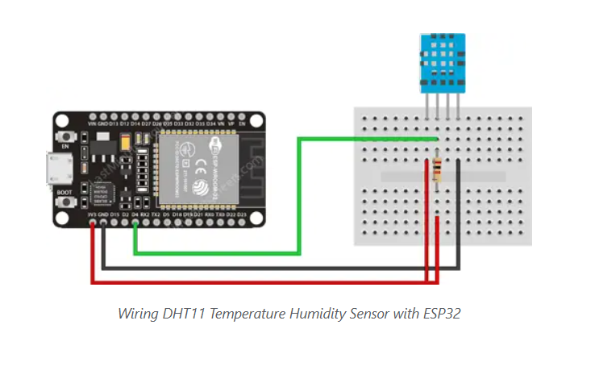
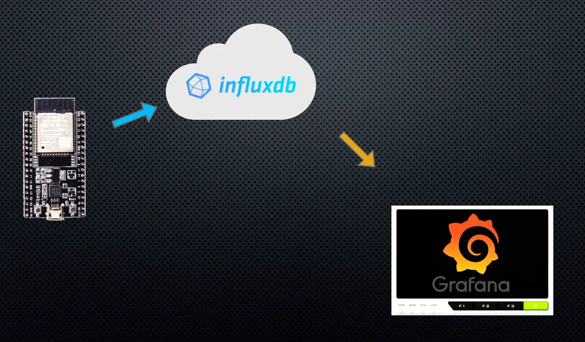
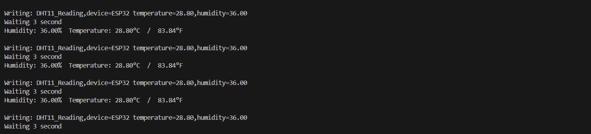
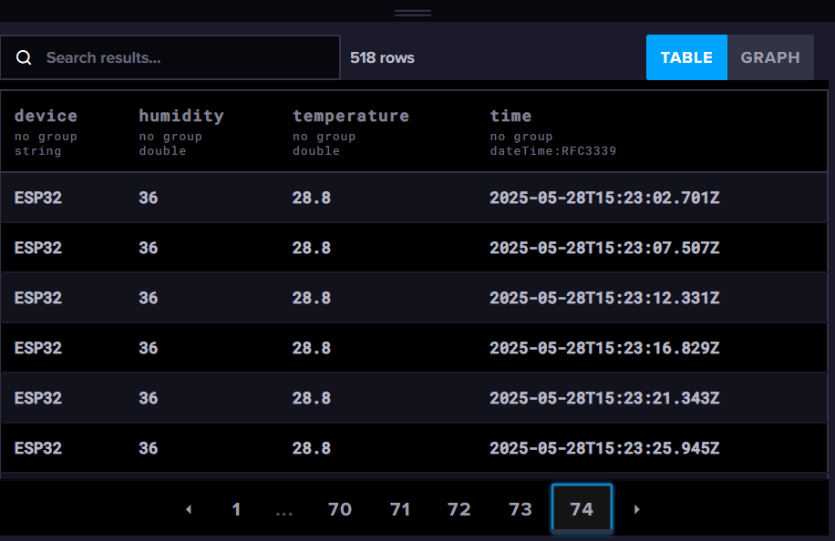
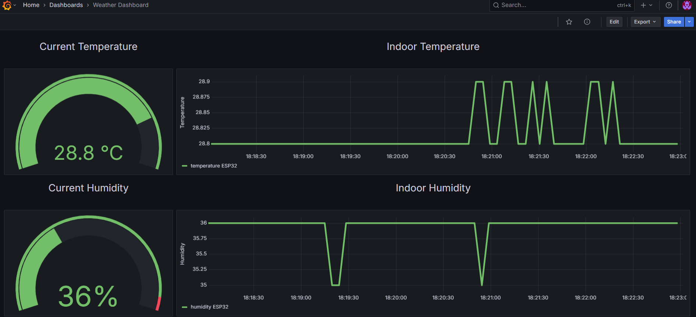

# Grafana Weather Dashboard using InfluxDB and an ESP32 
 we’re going to use an ESP32 as our data collection node to collect temperature, humidity and pressure readings from some DHT11 sensor. 
 It’ll then post these readings to an InfluxDB database and we’ll then use Grafana to visualise the data. 
 

# ESP32-Serial Monitor

# InfluxDB Database
Now we’ve got our information being sent to and stored in our database

# Grafana Weather Dashboard
That’s it, we’re now done creating our Grafana dashboard from data that we’re recording to InfluxDB using our DHT11 sensor and microcontroller.

